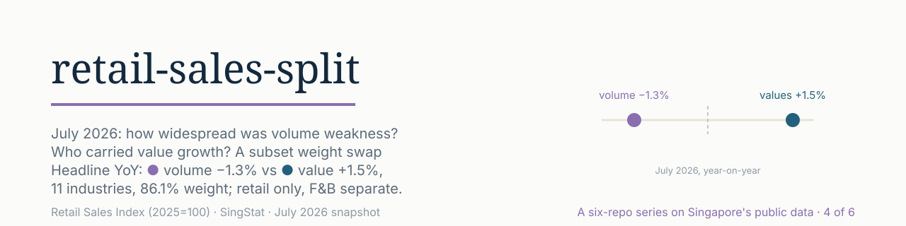
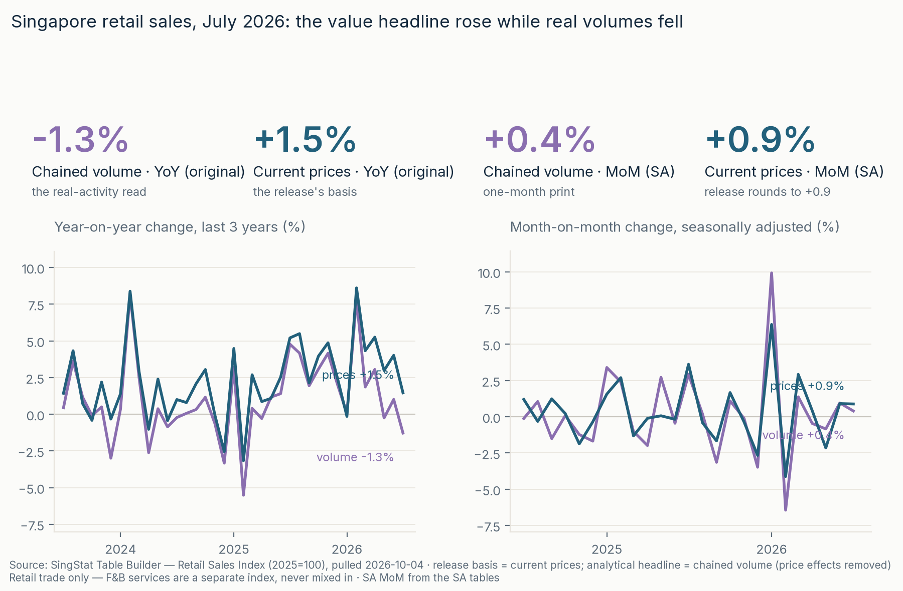
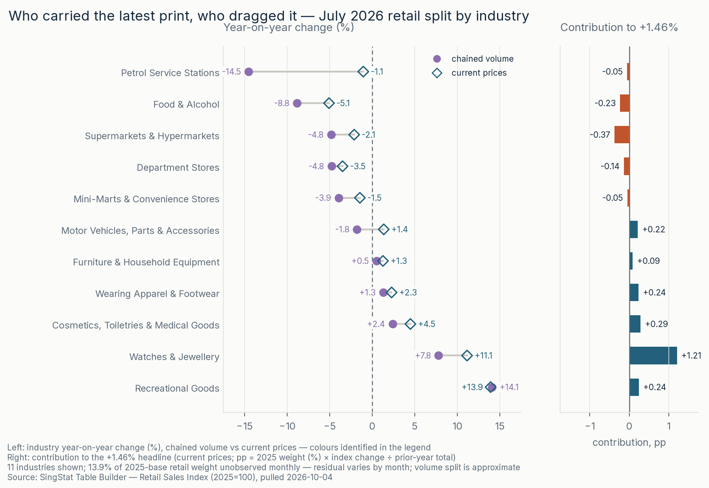
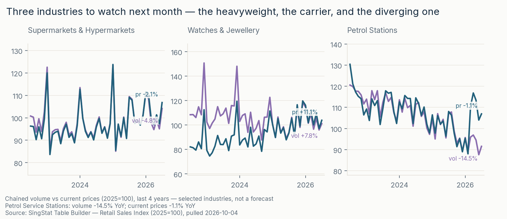

<picture>
  <source media="(prefers-color-scheme: dark)" srcset="assets/banner-dark.svg">
  <source media="(prefers-color-scheme: light)" srcset="assets/banner.svg">
  
</picture>

# retail-sales-split

[](https://github.com/faizsaifulnizam/retail-sales-split/actions/workflows/ci.yml) [](LICENSE)   [](https://tablebuilder.singstat.gov.sg/table/TS/M602201) [](https://public.tableau.com/views/SingaporeRetail/Singaporeretailsplitandrebased)

> **Answer:** July 2026 retail **value growth was concentrated in Watches & Jewellery, while volume weakness spanned six observed industries**. Chained-volume sales fell **−1.3% year-on-year**; sales value (current prices) rose **+1.5%**. **Six of eleven** industries with current monthly indices declined in volume, representing **47.8% of total 2025-base weight**; the observed subset covers **86.1%**. Supermarkets and petrol supplied the largest approximate volume drags (**−0.84 and −0.74 pp**), partly offset by watches (**+0.84 pp**). On value, **Watches & Jewellery contributed +1.21 pp** against total growth of **+1.46%**. The old/new weight swap raises a **renormalized 11-industry subset's** growth by **+0.21 pp**; it does **not** measure the rebase's effect on the published headline. Retail only; F&B services stay separate.

**Status:** built 2026-10-04; July 2026 snapshot. Local review-remediation verification and publication receipts are tracked separately in [`docs/review-remediation.md`](docs/review-remediation.md). Part of a six-repo series on Singapore's public data.

**[Open the interactive Tableau dashboard →](https://public.tableau.com/views/SingaporeRetail/Singaporeretailsplitandrebased)** · [Dashboard notes and verification](bi/README.md). Published July 2026 snapshot; not an automatically refreshing report.

## Key numbers (all reproducible)

- **Headline (Jul 2026):** chained volume **−1.28% YoY** · SA MoM **+0.40%**; current-price value **+1.46% YoY** (release: +1.5%) · SA MoM **+0.88%** (release: +0.9%). Both SA MoM measures rose.
- **The value split (fixed-weight calculation, not a complete identity):** Watches & Jewellery **+1.207 pp**; Cosmetics +0.288; Recreational Goods +0.243; Wearing Apparel +0.237; Motor Vehicles +0.217; Furniture +0.090; Supermarkets −0.370; Food & Alcohol −0.232; Department Stores −0.136; Petrol −0.054; Mini-Marts −0.049. The **full-precision covered sum is +1.4404 pp**, against **+1.4578%** total growth, leaving **+0.0174 pp residual**. Display-rounded components need not sum exactly. Missing coverage, linked-series aggregation and rounding can enter the residual; it is not an identified contribution from the three missing industries.
- **Rebase sensitivity:** Motor Vehicles' published weight **18.1% → 14.8%**; the same current indices yield subset growth of **+1.45%** with 2017 weights versus **+1.66%** with 2025 weights → **+0.21 pp**. Excludes three industries (13.9% of new weight), renormalizes the remainder, and does not reconstruct the old-base headline ([`outputs/rebase_read.csv`](outputs/rebase_read.csv)).
- **Data quality, July snapshot:** 14 Table Builder tables, **35,271/35,271 cells**, 0 exclusions; 12 staging checks. The release comparison has **19 recomputable rows** and three release-only rows. Its tolerance is **0.05 pp publication rounding + 0.001 pp index-precision allowance**, evaluated before rounding differences; it is not a strict ≤0.05 pp claim ([`outputs/release_check.csv`](outputs/release_check.csv)).

<picture>
  <source media="(prefers-color-scheme: dark)" srcset="reports/figures/f1_headline-dark.png">
  <source media="(prefers-color-scheme: light)" srcset="reports/figures/f1_headline.png">
  
</picture>

*YoY: volume fell while value rose. SA MoM: both rose (volume +0.40%, value +0.88%). Three years of history keep the one-month print in context.*

### More views

| | |
|---|---|
| <a href="reports/figures/f2_split.png"><picture><source media="(prefers-color-scheme: dark)" srcset="reports/figures/f2_split-dark.png"><source media="(prefers-color-scheme: light)" srcset="reports/figures/f2_split.png"></picture></a> | **The split** — the 11 observed industries ranked by their volume move, beside their calculated value contributions; residual kept separate ([`docs/decision_memo.md`](docs/decision_memo.md)). |
| <a href="reports/figures/f3_watch.png"><picture><source media="(prefers-color-scheme: dark)" srcset="reports/figures/f3_watch-dark.png"><source media="(prefers-color-scheme: light)" srcset="reports/figures/f3_watch.png"></picture></a> | **Three industries to watch** — Supermarkets (largest approximate volume drag), Watches & Jewellery (largest value contributor), Petrol (volume −14.5%, value −1.05%; not flat value). |

*Full size in [`reports/figures/`](reports/figures/) · write-up in [`docs/decision_memo.md`](docs/decision_memo.md) · dashboard-ready extract in [`outputs/tableau_extract.csv`](outputs/tableau_extract.csv) ([published Tableau Public dashboard](https://public.tableau.com/views/SingaporeRetail/Singaporeretailsplitandrebased); scope and checks in [`bi/README.md`](bi/README.md)).*

## Decision implications

**A positive nominal headline does not justify a category-wide inventory increase.** Volume weakness and concentrated value growth make the sector total a poor guide to a retailer's own demand. For a hypothetical retailer, the proposed next step is to compare its own category units sold and realised prices with margins, stock cover, markdowns and supplier lead times before changing orders.

- **Maintain current orders** if that review gives no clear reason to change, but check whether long lead times leave a stockout risk.
- **Adjust selected categories** where the retailer's own unit sales and stock cover support it, balancing stockout risk against cash tied up in inventory and later markdowns.
- **Consider a limited promotion** where excess stock and margin room support it, then review units, margin and stock cover before extending it. More sales value alone would not establish success.

These are proposed options, not actions taken or tested. Sector aggregates cannot tell a shop what to order or establish that an inventory or pricing change will improve results. See the [decision memo](docs/decision_memo.md) for the decision checks and trade-offs.

## The question

How widely did July's volume weakness spread, which industries carried value growth, and what can a weight swap tell us about the 2025 rebase? This repo reports **observed counts, weights and contributions**, rather than classifying the slowdown as “broad” or “narrow” without a threshold. Chained volume and current-price value are shown side by side; F&B services are a separate index.

## The data

- **Retail Sales Index & F&B Services Index (2025 = 100)** — SingStat Table Builder, 14 tables: RSI chained volume and current prices (monthly + seasonally adjusted), retail sales value (S$M), online-sales proportions, and quarterly detail ([`M602201`](https://tablebuilder.singstat.gov.sg/table/TS/M602201) and friends; full map in [`data/raw/README.md`](data/raw/README.md)). Snapshot latest month: **2026 Jul** (publisher stamp 07/09/2026).
- **Weights and release tables** are manually transcribed reference inputs in [`data/reference/`](data/reference/), with recorded provenance: March 2026 rebasing paper and July 2026 release Tables 1–2. This remediation does not freshly authenticate those PDFs.
- **Units:** index 2025=100; value tables in **S$M per month** (retail July: S$4,419M; F&B: S$1,607M); online proportions in **%**. [`src/download.py`](src/download.py) pulls all 14 tables into `data/raw/` (gitignored, SHA-256 + coverage manifest, structure-validated before replace).

## Method

DuckDB reads the raw JSON directly; staging creates tidy monthly and quarterly tables. The pipeline:

1. **Pull** — 14 tables and a release-stamped manifest: [`src/download.py`](src/download.py)
2. **Audit** — profile units, original vs SA, and compare the **dated release transcription** against raw Table Builder data: [`docs/data_audit.md`](docs/data_audit.md) · [`src/audit.py`](src/audit.py)
3. **Stage** — raw JSON → tidy long → monthly + quarterly tables; account for every cell: [`sql/01_staging.sql`](sql/01_staging.sql)
4. **Check** — 12 assertions (coverage, contiguity, ranges, documented stale gap), before parquet replacement: [`sql/05_checks.sql`](sql/05_checks.sql)
5. **Measure** — latest-month YoY + SA MoM on both bases: [`sql/02_metrics.sql`](sql/02_metrics.sql)
6. **Split** — fixed-weight calculations, coverage/residual history, weight-swap sensitivity: [`src/analysis.py`](src/analysis.py) → [`outputs/latest_split.csv`](outputs/latest_split.csv) · [`outputs/contribution_reconciliation.csv`](outputs/contribution_reconciliation.csv)
7. **Draw · write** — code-generated light/dark figures ([`src/figures.py`](src/figures.py)); snapshot memo ([`docs/decision_memo.md`](docs/decision_memo.md))

### The split, made computable

**Two bases, both shown:** current prices measure sales value; chained volume adjusts for price effects. Neither measures customer counts. **Fixed-weight contribution arithmetic:** for weight share wᵢ, industry index Lᵢ and published prior-year total I₀, calculate cᵢ = 100 × wᵢ × (Lᵢ₁ − Lᵢ₀) / I₀, in **percentage points of YoY growth**, not index points. The corresponding weighted index-point change has no I₀ normalization. Exact additivity requires compatible weights, industry indices and full coverage; it is **not established for this incomplete, linked monthly series**. July's small residual is not a general identity: June's covered sum is **+3.3093 pp** against **+4.0182%** total growth, leaving **+0.7088 pp**. Residuals remain visible rather than being forced to zero. Volume contributions using these fixed weights are **approximate** because the published series is chain-linked; July's −0.102 pp residual is not an error bound. **Weight swap:** compute each subset's weighted-index ratio under old/new weights using the same current indices. The +0.21 pp difference is a subset sensitivity, not the published headline's rebase effect.

### Rules chosen, and why

| Rule | Choice | Why |
|------|--------|-----|
| Comparison | latest month, **YoY (original) + SA MoM**, never mixed | YoY compares like seasonal periods; MoM uses seasonally adjusted data |
| Headline basis | **chained volume**, current-price value beside it | distinguish price-adjusted activity from sales value |
| Contributions | fixed-weight value calculation; volume approximate; show residual | coverage and linked-series aggregation prevent a claimed exact total identity |
| Motor Vehicles | show weight change, not an inferred headline effect | published weight fell 18.1→14.8%; other rebase changes are not isolated |
| Missing industries | name them and show coverage | Computer & Telecom (monthly index ends 1996), Optical & Books, Others: 13.9% of new weight |
| Retail vs F&B | never combined | separate indices, weights and industry definitions |
| Outliers | none applied | no trimming of official aggregate observations |
| Forecasts | none | this is a descriptive snapshot |

### Validation — receipts, not claims

- **July snapshot shape:** 35,271 cells retained, 0 exclusions; the staging pipeline has 12 checks. Parent reruns passed all 12 staging checks with the same retained-cell count; detailed receipts are in [`docs/review-remediation.md`](docs/review-remediation.md).
- **Release comparison:** [`outputs/release_check.csv`](outputs/release_check.csv) compares raw recomputations with the July transcription. Three unavailable rows are **`not_recomputed`**, not matches; excl-MV YoY is recomputable from values, but its SA MoM is unavailable. Tolerance: **0.051 pp** (0.05 + 0.001), applied to full-precision differences. A difference of about **0.050044 pp** explains why strict ±0.05 wording was removed.
- **Levels/share checks:** [`outputs/levels_check.csv`](outputs/levels_check.csv) checks **four transcribed July expectations** against Table Builder: retail S$4,419M, retail excl-MV S$3,679M, F&B S$1,607M, retail online share 15.4%. This checks local reference consistency, not fresh PDF authenticity.
- **Reconciliation:** July **+1.4404 pp covered +0.0174 pp residual = +1.4578% total growth**. In index-point units the covered move is **+1.4425** (≈+1.443) versus **+1.460** total; do not mix the units. History and coverage: [`outputs/contribution_reconciliation.csv`](outputs/contribution_reconciliation.csv).
- **Independent calculation seam:** `src/analysis.py` compares raw-JSON stdlib calculations of watches' value contribution and both total YoY rates with its DuckDB results; this is not independent data sourcing.
- **Reproducibility scope:** CSVs use stable LF output for unchanged inputs. PNG byte equality requires the same Python/dependencies/fonts/backend and manifest-derived date; cross-platform pixel or byte equality is not guaranteed. Two full same-environment runs matched all seven CSVs and six report/site figure pairs (19 artifact hashes). An isolated local clone with the uncommitted patch overlaid fetched all 14 live tables and reproduced all seven CSVs; it reused the existing pinned interpreter, not a fresh dependency installation.

### Limits

**Not a forecast; not a shop; not a causal story.** Industry aggregates cannot identify companies, customer counts or reasons for movement. The value/volume growth ratio implies **+2.77%** in the aggregate implicit deflator, not a CPI or customer-level price measure. The newest month is provisional; pre-2026 history is **linked** to the 2025 base rather than recalculated. SSIC 2025 classification moves cannot be reversed from these tables. Full list under **Caveats**.

### Principles this repo follows

1. **One question per repo** — method serves the question.
2. **Define before use** — basis, units, coverage and residual are stated before interpreting contributions.
3. **SQL first** — SQL measures growth; Python audits, splits and draws.
4. **Calculations regenerate; reference inputs and prose need review** — raw pulls are preserved, weights/releases are transcribed, and July narrative/testing anchors are deliberate snapshot locks.
5. **Limits are part of the deliverable.**

## Reproduce

```bash
git clone https://github.com/faizsaifulnizam/retail-sales-split && cd retail-sales-split
uv venv .venv --python 3.12          # or: python -m venv .venv
source .venv/bin/activate            # Windows: .venv\Scripts\activate
uv pip install -r requirements.txt   # or: pip install -r requirements.txt

python src/download.py --snapshot  # verified bundled July bytes; offline, preserves original manifest
python src/build_dataset.py  # staging + 12 checks → data/processed/*.parquet
python src/audit.py          # dated release, level/share checks → outputs/
python src/analysis.py       # split + rebase + sensitivity + reconciliation history → outputs/
python src/figures.py        # reports/figures/ + docs/img/ (light + dark)
```

For the same frozen offline acceptance used by CI, run `python tests/offline_ci.py` after dependency installation. It restores/builds the snapshot before discovery, rejects skipped or empty/incomplete suites, executes the dependency-backed numerical/render regressions and all producer stages, requires all seven regenerated CSVs to equal committed bytes, checks report/site mirrors, and runs the eight artifact smoke checks. The separate stdlib smoke job needs no third-party packages. Hosted Linux CI remains a publication check; same-environment PNG determinism is not cross-platform certification.

For the **July 2026 snapshot**, `outputs/latest_split.csv` shows Watches & Jewellery **+1.207 pp**, Supermarkets **−0.370 pp**, and retail Total **−1.28% volume / +1.46% value**. A later re-pull can move the newest month; these expectations apply to July, not an arbitrary latest row.

### Refreshing for next month's release

Use `python src/download.py --force`, then `build_dataset → audit → analysis → figures`. **A fresh pull alone is not a fully refreshed report:** the audit is tied to `data/reference/release-YYYY-MM-tables.csv` (currently July 2026); transcribe the new release, explicitly update its selection and level/share expectations, and review the prose, banners/social card, figures and snapshot locks. Keep the historical July anchor unless the publisher restates it; latest-month assertions should only apply when latest is July. Check the publisher's actual release date, not a fixed calendar assumption. Review coverage changes too: resumption of the monthly Computer & Telecom indices requires updating the documented gap and split rules.

## Caveats

- **Industry aggregates, not shops or customers** — no company-level, customer-count or causal reading.
- Newest month provisional; linked pre-2026 values are not the original old-base publications.
- Three industries lack current monthly index data; release rates are quoted as context, **not** converted into invented index levels or contributions.
- Fixed-weight current-price sums need a residual; historical values are not exact reconstructed contributions under contemporaneous old weights. Volume calculations are approximate, with no universal ±0.1 pp guarantee.
- Rebase sensitivity excludes 13.9% of new weight and renormalizes; classification and linking changes prevent reconstruction of the old headline.
- Retail online share is a value proportion, not the number of online buyers; no CPI, forecast or causal claim is made.

## Out of scope

A retail forecast, company-level analysis and macro consumption model. The published Tableau dashboard is a fixed July 2026 snapshot, not a live data feed or an exact historical contribution decomposition.

## Licence

Code: MIT. Data: Singapore Open Data Licence — © Singapore Department of Statistics. This is an independent, unofficial analysis.

---

*Six-on-SG: six Singapore-data analyses plus one AI workflow — seven repos:* **[hdb-resale-mart](https://github.com/faizsaifulnizam/hdb-resale-mart)** · **[card-book-quality](https://github.com/faizsaifulnizam/card-book-quality)** · **[coe-quota-premium](https://github.com/faizsaifulnizam/coe-quota-premium)** · **coe-category-break · hdb-lease-slope** · **[ai-analyst-workflow](https://github.com/faizsaifulnizam/ai-analyst-workflow)** (the AI-workflow add)

*If you found this useful, a star helps others find it.*
